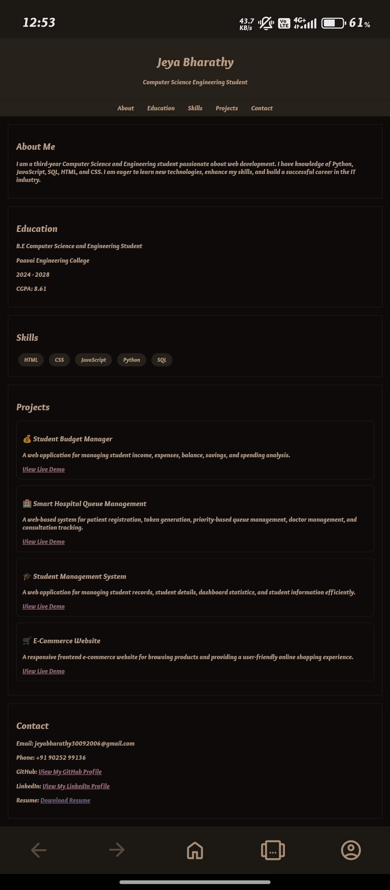

# 🌐 My Portfolio
Welcome to my personal portfolio website!  
This website showcases my education, technical skills, projects, and contact information.

## 👨‍💻 About Me
I am a third-year Computer Science and Engineering student with a passion for web development and software technologies.
I have knowledge of Python, JavaScript, SQL, HTML, and CSS. I am interested in learning new technologies, improving my skills, and building real-world projects.

## 🎓 Education

**Bachelor of Engineering – Computer Science and Engineering**

Currently pursuing 3rd year.

## 🛠️ Technical Skills
- HTML
- CSS
- JavaScript
- Python
- SQL
- C
- C++

## 🚀 Projects
### 💰 Smart Budget Manager
A web-based application for managing income, expenses, balance, and financial activities.

### 🏥 Smart Hospital Queue Management
A hospital queue management system designed to manage patients, doctors, tokens, and waiting queues.

### 👨‍🎓 Student Management System
A web application for managing student information using HTML, CSS, and JavaScript.

### 🛒 E-Commerce Website
A responsive frontend e-commerce website developed using web technologies.

## ✨ Portfolio Features
- About Me
- Education
- Technical Skills
- Projects
- Contact Information
- Responsive Design

## 💻 Technologies Used
- **HTML5** – Structure of the website
- **CSS3** – Styling and responsive design
- **JavaScript** – Interactive features and functionality
- **Git & GitHub** – Version control and project hosting

## 🌐 Live Demo
**View My Portfolio:**
https://jeyabharathy30092006-cpu.github.io/portfolio/

## 📸 Screenshot

